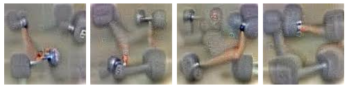

# ML-Dictionary-
This repo contains information of models and keywords used in machine learing

### 1. Feature Visualization 

This represents how the image looks like to the neural network. Thus giving an a visual of what the developed network sees. 

### 2. Feature Attribution

This studies what part of the image is actually reponsible for the activation of neural network.

### 3. Inceptionism : Going Deeper into Neural Network [3]
Some model Works whereas Others just fail out, reason for this is the input given to the neurons in layer.
The Network first looks into the edges and gradients, then patterns, Parts of Objects, Objects and then Scene and then gives the final decision. 
Each layer of the network deals with features at a different level of abstraction, so the complexity of features we generate depends on which layer we choose to enhance. For example, lower layers tend to produce strokes or simple ornament-like patterns, because those layers are sensitive to basic features such as edges and their orientations.

This image is developed from the various images shown to the neural network and its learning. 

For example : 

Here this is to identiy dumbells, but All the training images have muscles in it hence when just dumbells are given to text without muscles, it may identify it incorrectly hence the developer on looking at those images can identify where to make the changes and implement it to get the correct output.

### 4. Activation Space [4]
A Neuron cant actually decide and take a decision, it needs help of other neurons. Therefore activation space is a space where activation of all the neurons are combined and a decision is made.

### 5. Interaction between Neurons [4]

Ever Nueron gives its input and can generate a new output. This is very useful in classifying objects of same root. For example, A table Tennis ball and football both are balls, but both have different size, color and texture which seperates them from each other. So here for TT Ball, the shape nueron will fire but a neuron which stores the information of the white and black textures of ball will not. 

### 6. Types of Regulatization [4]
#### A. Frequency Penalization
#### B. Transformation robustness
#### C. Learned priors

## References
1.

2.

3. https://ai.googleblog.com/2015/06/inceptionism-going-deeper-into-neural.html

4. https://distill.pub/2017/feature-visualization/
